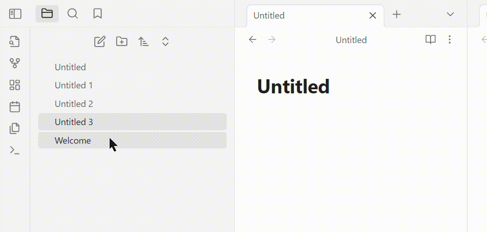

# Tooltip File Property in Explorer Plugin

Add one of the file properties in the frontmatter into the tooltip (e.g. Summary) in the file explorer.

## How to use

- **Set the property name in the setting**: default choice is `Summary`, feel free to change it to anything you need.
- **Cannot**:
  - Cannot show a property that occupies of multiple lines.
  - May not work at the first attempt after workspace initialing.

## Contact

I'll appreciate any suggestions and trouble shooting reports. It means a lot as I will keep going try developing more tools.

*supergreenhandrsoc@gmail.com*